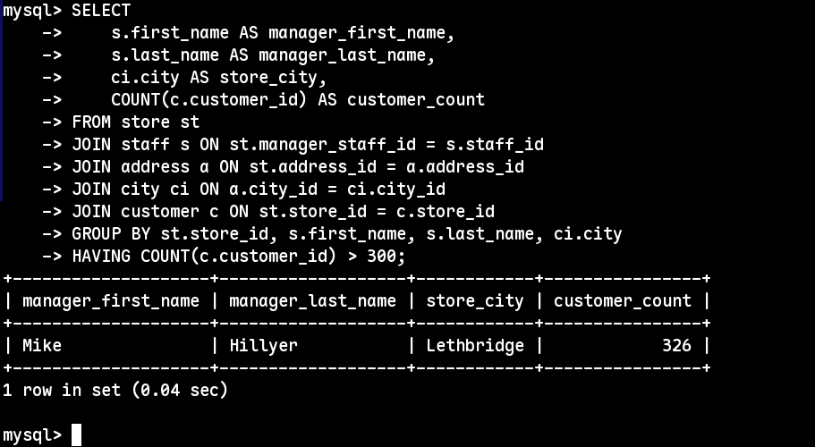
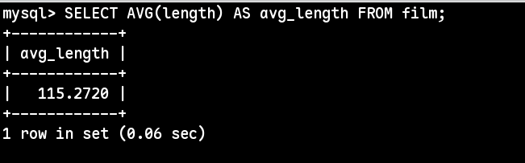
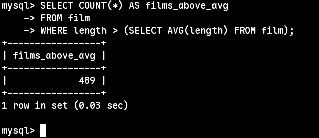
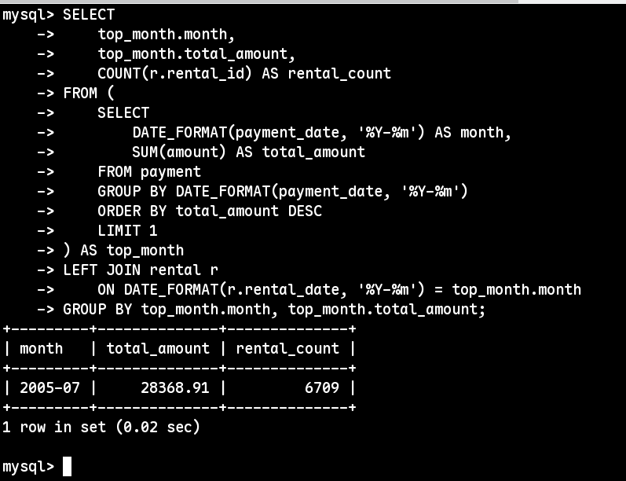

## Домашнее задание к занятию «SQL. Часть 2» - Шаров Олег

---

## Задание 1

Одним запросом получите информацию о магазине, в котором обслуживается более 300 покупателей, и выведите в результат следующую информацию:
- фамилия и имя сотрудника из этого магазина;
- город нахождения магазина;
- количество пользователей, закреплённых в этом магазине.

### Решение

Используем учебную базу данных **Sakila** (MySQL).

**SQL-запрос:**
```sql
SELECT 
    s.first_name AS manager_first_name,
    s.last_name AS manager_last_name,
    ci.city AS store_city,
    COUNT(c.customer_id) AS customer_count
FROM store st
JOIN staff s ON st.manager_staff_id = s.staff_id
JOIN address a ON st.address_id = a.address_id
JOIN city ci ON a.city_id = ci.city_id
JOIN customer c ON st.store_id = c.store_id
GROUP BY st.store_id, s.first_name, s.last_name, ci.city
HAVING COUNT(c.customer_id) > 300;
```



### Пояснение:
- Магазин №1 в городе **Lethbridge** обслуживает **326 покупателей** (> 300).
- Менеджер магазина: Mike Hillyer.
- Связи таблиц:
  - `store.manager_staff_id → staff.staff_id` (получаем менеджера)
  - `store.address_id → address.address_id → city.city_id` (получаем город)
  - `store.store_id → customer.store_id` (считаем покупателей)

- Фильтрация после агрегации выполнена через `HAVING COUNT(...) > 300`.


## Задание 2

Получите количество фильмов, продолжительность которых больше средней продолжительности всех фильмов.

### Решение

Таблица: `film`, поле `length` — продолжительность фильма в минутах.

**Шаг 1. Средняя продолжительность всех фильмов:**
```sql
SELECT AVG(length) AS avg_length FROM film;
```

Результат: 115.2720 минут.



###  Количество фильмов длиннее среднего:

```sql
SELECT COUNT(*) AS films_above_avg
FROM film
WHERE length > (SELECT AVG(length) FROM film);
```



### Пояснение:
- Подзапрос `(SELECT AVG(length) FROM film)` вычисляет среднюю продолжительность один раз и возвращает скалярное значение `(115.2720)`.
- Основной запрос фильтрует фильмы по условию `length > 115.2720` и подсчитывает их количество.
- Использование скалярного подзапроса в `WHERE` — наиболее эффективный и читаемый способ для данной задачи.

## Задание 3

Получите информацию, за какой месяц была получена наибольшая сумма платежей, и добавьте информацию по количеству аренд за этот месяц.

### Решение

Таблицы: `payment` (платежи) и `rental` (аренды).  
Ключевые поля: `payment.payment_date`, `payment.amount`, `rental.rental_date`.

**SQL-запрос:**
```sql
SELECT 
    top_month.month,
    top_month.total_amount,
    COUNT(r.rental_id) AS rental_count
FROM (
    SELECT 
        DATE_FORMAT(payment_date, '%Y-%m') AS month,
        SUM(amount) AS total_amount
    FROM payment
    GROUP BY DATE_FORMAT(payment_date, '%Y-%m')
    ORDER BY total_amount DESC
    LIMIT 1
) AS top_month
LEFT JOIN rental r 
    ON DATE_FORMAT(r.rental_date, '%Y-%m') = top_month.month
GROUP BY top_month.month, top_month.total_amount;
```



### Пояснение:
- Месяц определяется через `DATE_FORMAT(payment_date, '%Y-%m')`, что даёт формат `ГГГГ-ММ` (например, `2005-07`).
- Подзапрос группирует платежи по месяцам, суммирует их и выбирает месяц с максимальной суммой через `ORDER BY ... DESC LIMIT 1`.
- Внешний запрос присоединяет таблицу `rental` по тому же месяцу и считает количество аренд через `COUNT(rental_id)`.
- В учебной базе Sakila все данные относятся к 2005 году, поэтому максимальный месяц — июль 2005 (`2005-07`).


